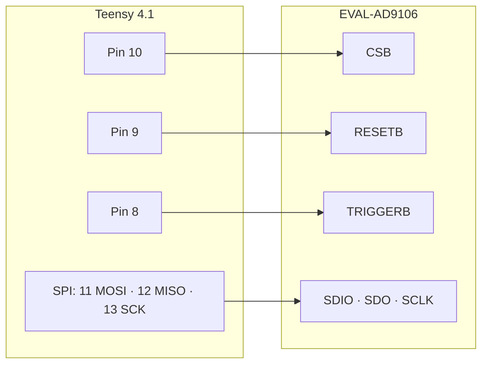

# AD9106 SRAM Driver for Teensy 4.1

A Teensy 4.1 port of Analog Devices' official AD9106/AD9102 mbed driver. It loads waveform vectors into the DAC's SRAM and plays them back as patterns, with no SDP-K1 board required.

**English** · [繁體中文](README.zh-TW.md)

## Wiring

The pins are set in the `AD910x_TEENSY(CSB, RESETB, TRIGGERB)` constructor. SPI runs 16-bit, mode 0.

## Quick start

1. Open `teensy_main/teensy_main.ino` in the Arduino IDE with Teensyduino installed.
2. Upload the sketch, then open the Serial Monitor at 115200 baud.
3. Send a command:

| Command | Pattern |
|---|---|
| `1` | 4 pulses with different start delays and digital gains |
| `2` | 4 pulses played from a 4096-point ramp vector |
| `s` | Stop |

To target the AD9102, uncomment `#define DEV_AD9102` in `config.h`.

## Files

| File | Contents |
|---|---|
| `teensy_ad910x.h/.cpp` | Driver: SPI read/write, register reset, SRAM update, start/stop |
| `config.h` | Device selection and example register values, from ADI under Apache-2.0 |
| `teensy_main/teensy_main.ino` | Serial-menu demo |
