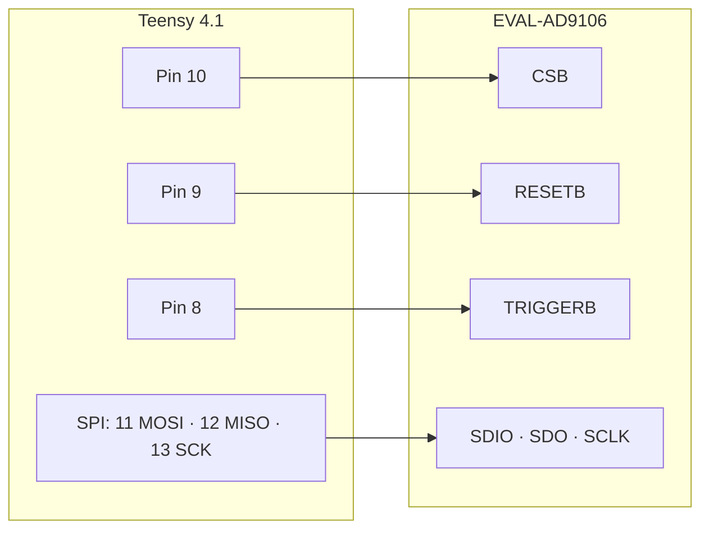

# AD9106 SRAM Driver for Teensy 4.1

A Teensy 4.1 port of Analog Devices' official AD9106/AD9102 mbed driver. It loads waveform vectors into the DAC's SRAM and plays them back as patterns, with no SDP-K1 board required.

<b>English</b>

## Wiring

The pins are set in the `AD910x_TEENSY(CSB, RESETB, TRIGGERB)` constructor. SPI runs 16-bit, mode 0.

## Quick start

1. Open `teensy_main/teensy_main.ino` in the Arduino IDE with Teensyduino installed.
2. Upload the sketch, then open the Serial Monitor at 115200 baud.
3. Send a command:

| Command | Pattern |
|---|---|
| `1` | 4 pulses with different start delays and digital gains |
| `2` | 4 pulses played from a 4096-point ramp vector |
| `s` | Stop |

To target the AD9102, uncomment `#define DEV_AD9102` in `config.h`.

## Files

| File | Contents |
|---|---|
| `teensy_ad910x.h/.cpp` | Driver: SPI read/write, register reset, SRAM update, start/stop |
| `config.h` | Device selection and example register values, from ADI under Apache-2.0 |
| `teensy_main/teensy_main.ino` | Serial-menu demo |

## Part of

This is one of the drivers for [piezo-motor-visual-servo](https://github.com/liu092111/piezo-motor-visual-servo), a camera-in-the-loop controller for a piezoelectric ultrasonic motor.

<b>繁體中文</b>

把 Analog Devices 官方的 AD9106/AD9102 mbed 驅動程式移植到 Teensy 4.1。程式會把波形向量寫進 DAC 的 SRAM，再以 pattern 方式播放，不需要 SDP-K1 開發板。

## 接線

腳位在 `AD910x_TEENSY(CSB, RESETB, TRIGGERB)` 建構子中設定。SPI 使用 16-bit、mode 0。

## 快速開始

1. 安裝 Teensyduino，再用 Arduino IDE 開啟 `teensy_main/teensy_main.ino`
2. 上傳程式，然後以 115200 baud 開啟 Serial Monitor
3. 送出指令：

| 指令 | 輸出的 pattern |
|---|---|
| `1` | 4 個脈衝，起始延遲與數位增益各不相同 |
| `2` | 從 4096 點斜坡向量播放 4 個脈衝 |
| `s` | 停止 |

如果要改用 AD9102，請在 `config.h` 取消註解 `#define DEV_AD9102`。

## 檔案

| 檔案 | 內容 |
|---|---|
| `teensy_ad910x.h/.cpp` | 驅動程式：SPI 讀寫、暫存器重設、SRAM 更新、開始／停止 |
| `config.h` | 裝置選擇與範例暫存器值，來自 ADI 官方（Apache-2.0） |
| `teensy_main/teensy_main.ino` | 以序列埠選單操作的範例程式 |

## 所屬專案

這是 [piezo-motor-visual-servo](https://github.com/liu092111/piezo-motor-visual-servo) 的驅動程式之一。該專案以攝影機閉迴路控制壓電超音波馬達。

