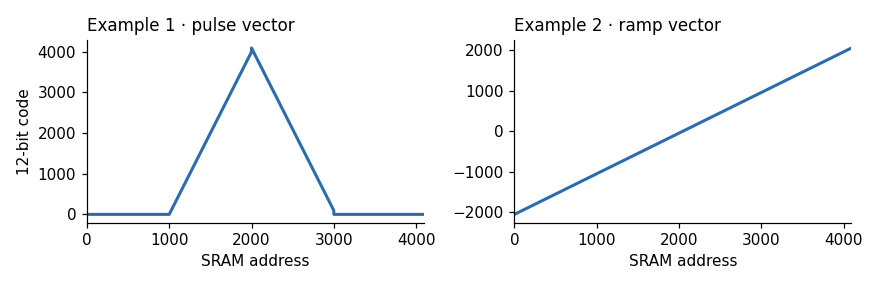
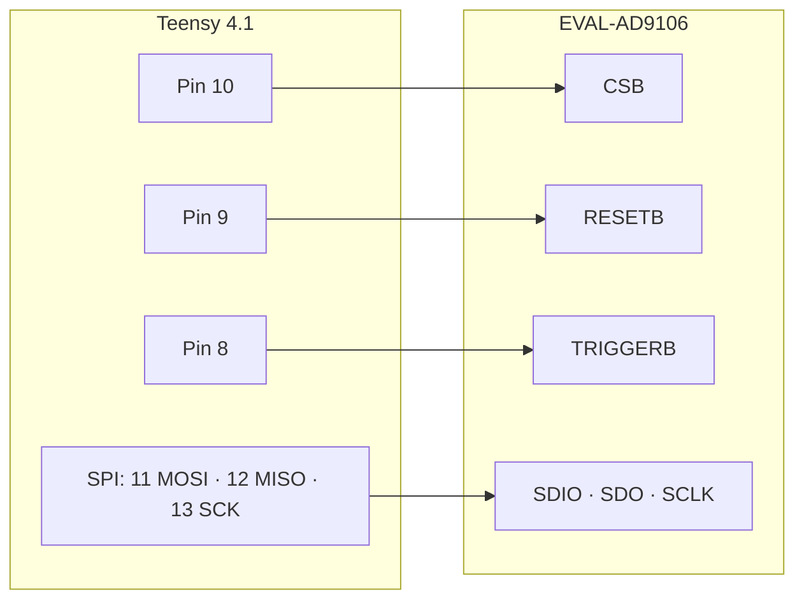

# AD9106 SRAM 驅動程式（Teensy 4.1）

把 Analog Devices 官方的 AD9106/AD9102 mbed 驅動程式移植到 Teensy 4.1。程式會把波形向量寫進 DAC 的 SRAM，再以 pattern 方式播放，不需要 SDP-K1 開發板。

[English](README.md) · **繁體中文**

## 接線

腳位在 `AD910x_TEENSY(CSB, RESETB, TRIGGERB)` 建構子中設定。SPI 使用 16-bit、mode 0。

## 快速開始

1. 安裝 Teensyduino，再用 Arduino IDE 開啟 `teensy_main/teensy_main.ino`
2. 上傳程式，然後以 115200 baud 開啟 Serial Monitor
3. 送出指令：

| 指令 | 輸出的 pattern |
|---|---|
| `1` | 4 個脈衝，起始延遲與數位增益各不相同 |
| `2` | 從 4096 點斜坡向量播放 4 個脈衝 |
| `s` | 停止 |

如果要改用 AD9102，請在 `config.h` 取消註解 `#define DEV_AD9102`。

## 檔案

| 檔案 | 內容 |
|---|---|
| `teensy_ad910x.h/.cpp` | 驅動程式：SPI 讀寫、暫存器重設、SRAM 更新、開始／停止 |
| `config.h` | 裝置選擇與範例暫存器值，來自 ADI 官方（Apache-2.0） |
| `teensy_main/teensy_main.ino` | 以序列埠選單操作的範例程式 |
